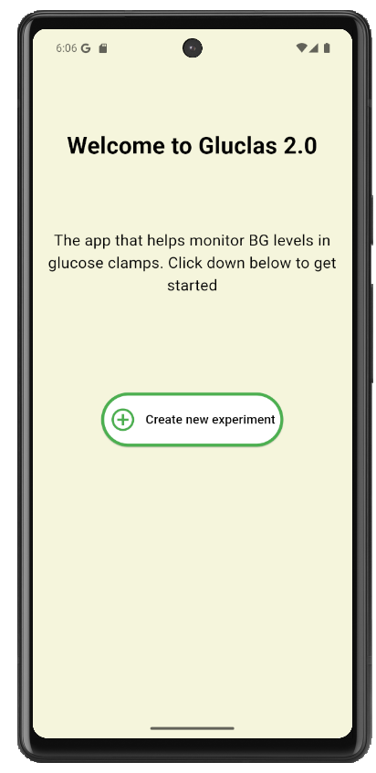
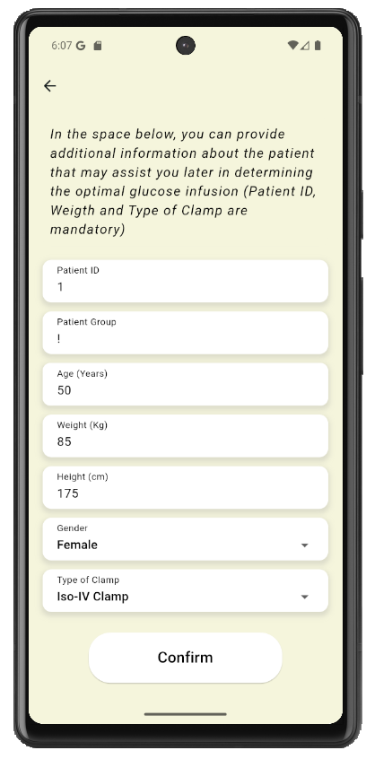
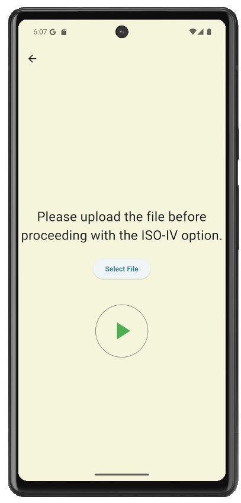
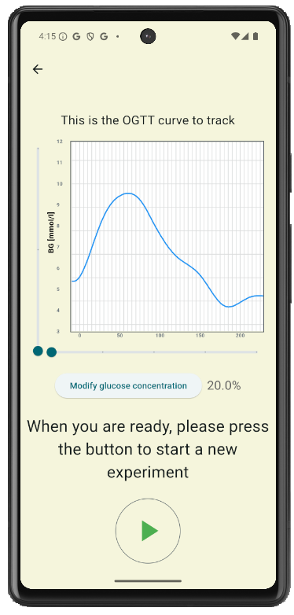
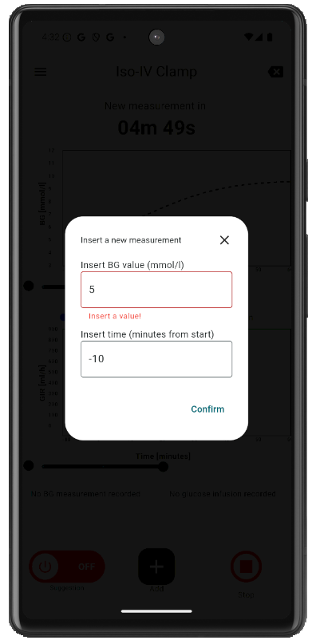
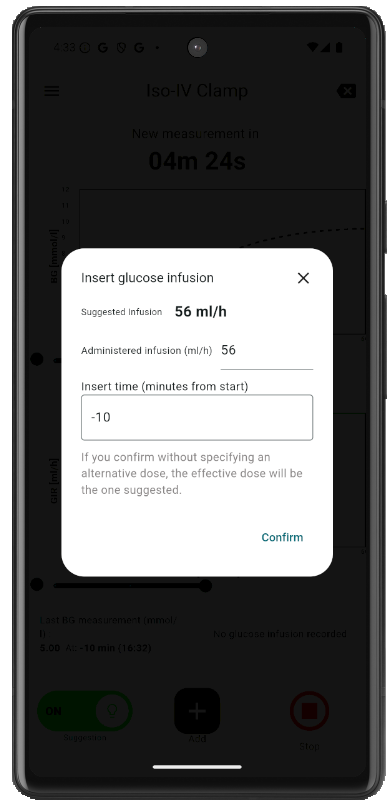
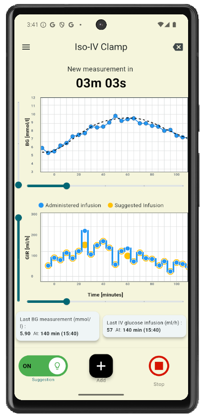
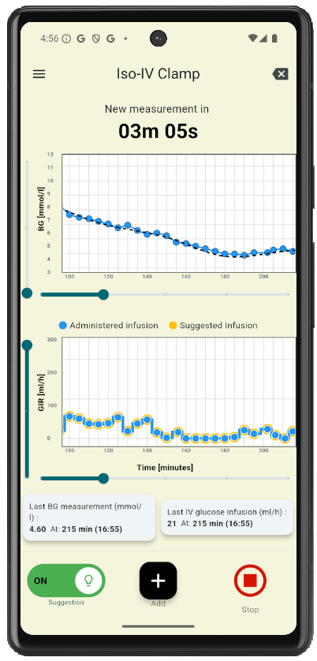

# Gluclas 2.0

**Gluclas 2.0** is an open-source mobile application for clinical decision support during ISOglycemic intravenous glucose (ISO-IV) clamp experiments.

The application assists investigators in modulating the **glucose infusion rate (GIR)** in order to reproduce a reference blood glucose (BG) profile obtained from an oral glucose tolerance test (OGTT). At each measurement, Gluclas 2.0 processes the current BG value together with the reference trajectory and provides a suggested GIR. The investigator remains responsible for reviewing the suggestion and deciding whether and how to implement it on the infusion pump.

Gluclas 2.0 implements a **Proportional-Integral-Derivative (PID) controller with a personalized feed-forward component** for proactive tracking of the OGTT-derived glucose trajectory.

> **Important:** Gluclas 2.0 is an investigational research tool. It is not an approved medical device or approved medical software. Control suggestions must be critically reviewed and verified by the clinician responsible for the experiment.

---

## Contents

* [Project overview](#project-overview)
* [Clinical and technical background](#clinical-and-technical-background)
* [Main features](#main-features)
* [Application workflow](#application-workflow)
* [Mobile app interface](#-mobile-app-interface)
* [Patient information](#patient-information)
* [OGTT reference input](#ogtt-reference-input)
* [CSV input file format](#csv-input-file-format)
* [Installation](#installation)
* [Source code](#source-code)
* [Disclaimer](#disclaimer)
* [License](#license)
* [How to cite](#how-to-cite)
* [Contact](#contact)

---

## Project overview

Gluclas 2.0 was developed to support researchers performing ISO-IV glucose clamp experiments.

In an ISO-IV clamp, the objective is to reproduce, through intravenous glucose administration, the blood glucose trajectory observed during a previous OGTT session. The procedure is traditionally performed by repeatedly measuring BG and manually adjusting the glucose infusion rate. This may introduce operator-dependent variability, particularly when measurements or interventions occur with delays or at irregular time intervals.

Gluclas 2.0 provides a semi-automated decision-support workflow:

1. A smoothed OGTT glucose curve is loaded as the reference trajectory.
2. The investigator enters BG measurements during the ISO-IV experiment.
3. The application calculates a GIR suggestion using the control algorithm.
4. The investigator reviews the suggestion.
5. The investigator may accept or modify the suggested GIR.
6. The actual administered infusion is recorded in the application.
7. Measurements, infusion data and notes can be reviewed and exported.

The system is deliberately designed as a **human-in-the-loop** decision-support system. The application does not directly control the infusion pump.

---

## Clinical and technical background

The application is primarily intended for ISO-IV glucose clamp experiments used to investigate the incretin effect.

The experiment consists of two main sessions:

* an **OGTT session**, in which the participant's glucose profile is recorded following oral glucose administration;
* an **ISO-IV clamp session**, in which intravenous glucose infusion is adjusted to reproduce the previously recorded OGTT glucose trajectory.

The OGTT-derived profile is used by Gluclas 2.0 as the reference trajectory that the controller attempts to track.

The controller combines:

* a proportional action;
* an integral action with anti-wind-up;
* a derivative action;
* a personalized feed-forward action based on the expected future evolution of the reference trajectory.

The feed-forward component uses patient-specific information, including body weight, to adapt the control action to the participant.

For a detailed description of the control methodology, validation procedures and clinical results, please refer to the associated scientific publication.

---

## Main features

Gluclas 2.0 provides the following functionality:

* creation of a new glucose clamp experiment;
* storage of patient and experiment information;
* loading of an OGTT-derived reference glucose curve;
* visualization of the reference trajectory;
* entry of BG measurements;
* manual specification and correction of measurement times;
* PID + feed-forward GIR suggestions;
* manual adjustment of the suggested GIR;
* recording of the actually administered infusion;
* visualization of glucose and infusion-related experiment data;
* automatic five-minute measurement reminders;
* manual opening of the measurement dialog;
* ability to enable or disable controller suggestions;
* correction and deletion of previously entered data;
* addition of experiment notes;
* export of experiment data.

---

## Application workflow

A typical experiment follows this workflow.

### 1. Create a new experiment

From the home screen, the investigator starts a new glucose clamp experiment.

### 2. Enter patient information

The application requests the information necessary to identify the experiment and personalize the controller.

The patient information is divided into mandatory and optional fields; see [Patient information](#patient-information).

### 3. Load the OGTT reference curve

The investigator uploads the smoothed OGTT glucose curve that will be used as the reference trajectory during the ISO-IV clamp.

The reference curve is supplied as a CSV file with the structure described in [CSV input file format](#csv-input-file-format).

### 4. Review the reference

After upload, the reference curve is displayed in the application.

The investigator can also configure the glucose concentration of the solution used for the infusion-rate calculation.

### 5. Enter BG measurements

During the experiment, the investigator enters each available BG measurement together with its corresponding measurement time.

The measurement timestamp is deliberately operator-adjustable; see [Timestamp handling during the experiment](#timestamp-handling-during-the-experiment).

### 6. Review the GIR suggestion

After the BG measurement is confirmed, the application provides a suggested glucose infusion rate.

The suggestion is calculated by the control algorithm using the current BG measurement, the reference trajectory and patient-specific information.

### 7. Enter the actual administered infusion

The investigator reviews the suggested GIR and decides how to implement it on the infusion pump.

The actual administered GIR and the corresponding infusion information are then recorded in the application.

### 8. Continue the experiment

The experiment screen provides visual monitoring of the collected data and includes a five-minute timer.

When the timer expires, the application automatically prompts the investigator for the next BG measurement. The measurement dialog can also be opened manually.

Previously entered measurements can be corrected or deleted, and notes can be added during the experiment.

### 9. Export the experiment

At the end of the experiment, the recorded experiment data and notes can be exported as a CSV file.

---

## 📱 Mobile app interface

The following screenshots illustrate the main steps of a typical Gluclas 2.0 workflow.

### Experiment initiation

The experiment starts from the home screen. The investigator then enters the patient information, uploads the smoothed OGTT reference curve, and confirms the reference trajectory before starting the experiment.

| Home | Patient information |
| --- | --- |
|  |  |

| Reference upload | Reference confirmation |
| --- | --- |
|  |  |

### Measurement and GIR suggestion

During the experiment, the investigator enters the measured BG value and its corresponding measurement time. Gluclas 2.0 then provides a GIR suggestion, which can be reviewed and modified before being implemented on the infusion pump.

| BG measurement | GIR suggestion |
| --- | --- |
|  |  |

### Experiment monitoring

During the clamp, the experiment screen provides visual feedback on the glucose trajectory and glucose infusion rate. The investigator can enter additional measurements, correct previously recorded data, and add notes during the experiment.

| Experiment monitoring | Experiment monitoring |
| --- | --- |
|  |  |
---
## Patient information

### Mandatory fields

Only the following patient information is required to start an experiment:

| Field         | Required | Purpose                                                                          |
| ------------- | -------: | -------------------------------------------------------------------------------- |
| `patient ID`  |      Yes | Uniquely associates the recorded data with the corresponding patient/experiment. |
| `body weight` |      Yes | Used to personalize the control action.                                          |

### Optional fields

The application also allows investigators to provide additional information such as:

* age;
* height;
* group.

These fields are **not used by the control algorithm**.

They are collected to facilitate consistent recording of potentially useful demographic or study-related information for later analysis. For example, these variables can support characterization of the population included in a clinical study.

Therefore, optional patient information should not be interpreted as additional inputs required by the controller.

### Data minimization

The application is designed so that only information required for the experiment or potentially useful for subsequent research analyses is requested.

The scientific paper describes patient ID and body weight as mandatory, while age, group and height are optional.

---

## OGTT reference input

Before starting the ISO-IV clamp, the investigator must load an OGTT-derived glucose reference curve.

The reference curve represents the glucose trajectory that the control algorithm will attempt to reproduce during the ISO-IV experiment.

The application expects the reference curve in CSV format.

The supported structure is described below.

---

## CSV input file format

### Required structure

The input CSV file must contain **exactly two data rows**:

| Row      | Description                | Expected content                                     |
| -------- | -------------------------- | ---------------------------------------------------- |
| `time`   | Measurement/reference time | Time in minutes relative to the OGTT reference point |
| `values` | Blood glucose value        | Blood glucose concentration in mmol/L                |

The expected row names are:

```text
time
values
```

The file therefore represents pairs of:

```text
(time, glucose value)
```

where `time` is expressed in minutes and `values` represents blood glucose concentration in mmol/L.

### Time row

The `time` row contains the time associated with each glucose value.

The OGTT is baseline-anchored at:

```text
t = 0 min
```

where `t = 0` corresponds to the beginning of the oral glucose load.

Negative times are allowed because baseline BG measurements may be collected before the oral glucose load.

For example:

```text
t = -10 min
t = -5 min
t = 0 min
t = 5 min
...
```

### Values row

The `values` row contains blood glucose concentrations.

The BG values are expressed in:

```text
mmol/L
```

The input values should therefore correspond to the glucose concentration represented by the OGTT reference trajectory.

### Required time range

The application accepts reference and measurement times down to:

```text
t = -10 min
```

**Times earlier than −10 minutes are not accepted.**

For example:

* `t = -10 min` → accepted;
* `t = -5 min` → accepted;
* `t = 0 min` → accepted;
* `t = -15 min` → rejected.

When a time earlier than −10 minutes is entered, the application displays an error message and does not compute a control action for that invalid input.

This negative-time functionality is intentional. In clinical clamp workflows, baseline samples may be collected before the oral glucose load, which is conventionally used as the `t = 0` reference point.

### Example CSV
A complete example CSV file is provided in this repository:

[📥 Download `Smoothed_OGTT_for_GLUCLAS2_example.csv`](https://github.com/GIOTUBA/Gluclas-2.0-app-apk/releases/download/v1.0.0-paper/Smoothed_OGTT_for_GLUCLAS2_example.csv)

Please use this file as the canonical example when preparing input files for the application.

---

## Installation

You can download the latest .apk file from the **[Releases](https://github.com/GIOTUBA/Gluclas-2.0-app/releases)** section of this repository and install it on an Android device.

No Flutter development environment is required to install and use the released application.


## Source code

The full source code of the application is available in the following repository:

👉 https://github.com/GIOTUBA/Gluclas-2.0-app-source-code


The source code repository contains the complete Flutter project and is intended for developers who want to inspect, modify, or build the application from source.

---

## Disclaimer

Gluclas 2.0 is **not an approved medical software or medical device**.

It is an investigational tool intended to provide infusion-rate suggestions during experimental glucose clamp procedures. Suggestions must be critically interpreted, reviewed and verified by the clinician responsible for the experiment, who remains responsible for clinical decisions.

The authors and developers of Gluclas 2.0 assume no responsibility for medical consequences resulting from inappropriate interpretation or use of the software.

This disclaimer is consistent with the statement included in the scientific manuscript.
